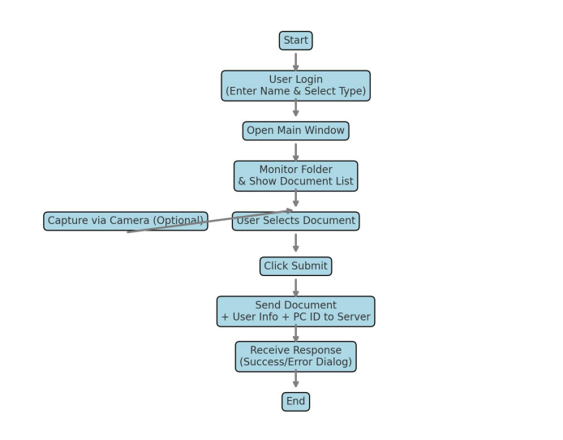

# Client-Side Documentation 

## 1. Project Overview

Project Description:

"docflow" is a Windows application developed for document management and processing. In this sprint, a
crucial feature has been implemented - the ability to submit a selected document to a processing server,
including relevant user information such as name, selected document type, and PC identifier.

## 2. Installation and Launch

System Requirements:

- Operating System: Windows 10 or newer
- .NET SDK: Version 6 or higher

Installation:

- Clone the project from the GitHub repository.
- Open the docflow.sln solution file in Visual Studio.
- Build and run the application using Visual Studio.

## 3. Application Architecture

Application Components:

- User Login: Window for entering username and selecting document type.
- Folder Monitoring: Automatically detects newly added documents in a predefined folder.
- Document Scanning: Supports capturing images via webcam for document input.
- Document Submission: Sends the document to the processing server with associated user metadata.
- UI Enhancements: Window resizing, folder path visibility, and document list population improvements.

## 4. Detailed Component Descriptions

User Login:

- Function: Allows users to enter their name and choose the type of document.
- Technology: WinUI 3, C#, HttpClient used to fetch available document types via API.

Folder Monitoring:

- Function: Monitors a dedicated folder (My Documents/FileFolder) for new files.
- Technology: FileSystemWatcher is used to automatically detect changes.

Document Scanning:

- Function: Captures photos using a webcam and stores them directly in the watch folder.
- Technology: OpenCvSharp library integrated for real-time image processing.

Document Submission:

- Function: Submits the selected document to a server endpoint along with:
- Username (entered on login screen)
- PC name (auto-fetched)
- Selected document type
- Technology: HttpClient + MultipartFormDataContent is used to create and send a POST request to the
server.

## 5. User Guide

Logging In:

- Launch the application.
- Enter your name in the Username field.
- Select a document type from the dropdown.
- Click "Continue" to proceed.

Adding Documents:

- Place documents in the My Documents/FileFolder directory manually, or use the built-in camera function to
scan and save them.

Submitting Document:

- Select a document from the list.
- Click the Submit button.
- A confirmation dialog will appear indicating success or failure of the submission.

## 6. API Documentation

Endpoints:

- GET /document/types - Fetches all available document types.
- POST /document - Receives uploaded document and metadata from the client application.

POST Payload:

- user (string): Username
- pc (string): Machine name
- type (string): Selected document type
- file (file): Document file in binary format

## 7. Security Practices

Implemented Measures:

- Input validation: Ensures name and document type are not empty.
- Controlled file types: Only .pdf, .jpg, .jpeg, .png are accepted.
- User data is encapsulated and sent via secured multipart form requests.
- Server responses are displayed clearly to the user for transparency.

## 8. Error Handling

Common Scenarios:

- Camera not working: Message displayed - "Failed to open camera."
- No document selected: Error - "You must select a document."
- Network/API error: Dialog displays message returned by the exception.

## 9. Conclusion

Maintenance and Support:

- Application is updated and maintained in iterative sprints.
- Support is available via the developer team.

# Appendix: Process Flowchart

